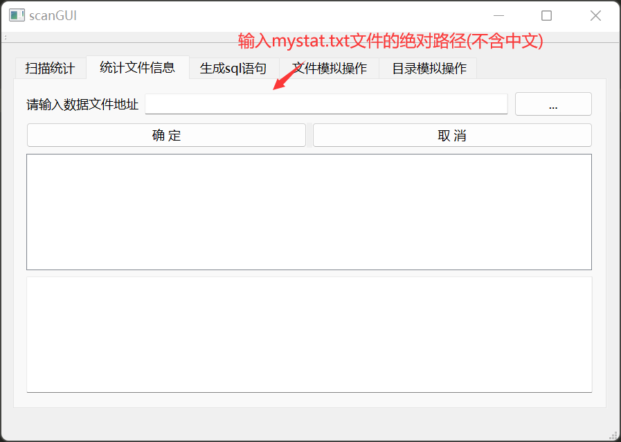
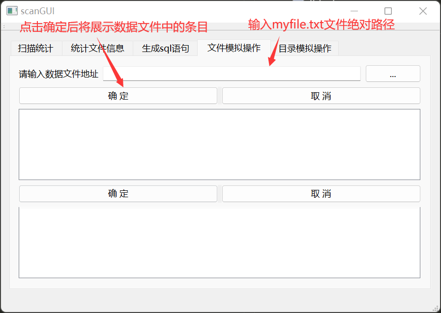
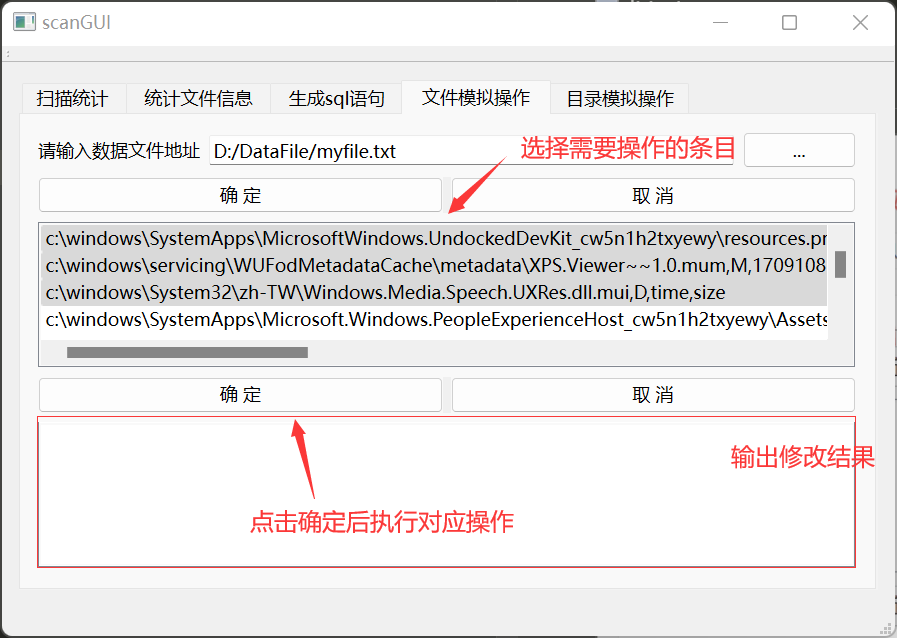
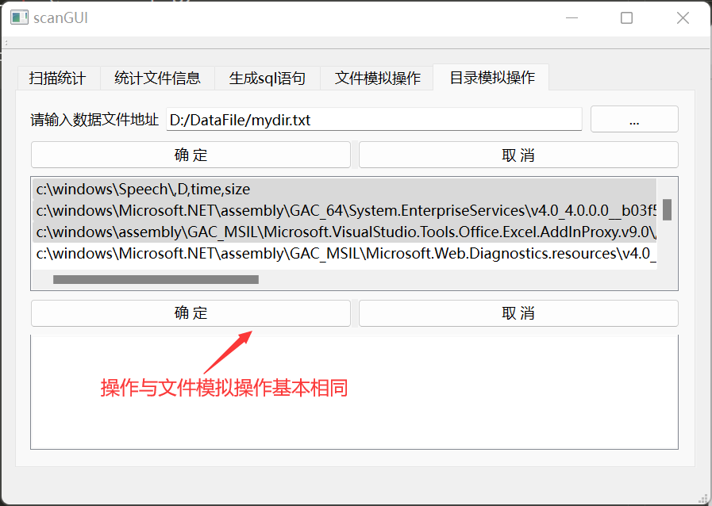

# 程序启动方法
直接点击"可独立运行的可执行程序"文件夹下的"scanGUI.exe"程序即可  
# 程序各模块使用说明
## 扫描统计模块  
**注：在不执行本模块功能的情况下无法使用其他模块**  
HNGGF]D}%X1@ZE4W9_1P.png>)  
## 统计文件信息模块  
  
首先输入mystat.txt绝对路径  
点击确定后开始进行统计得到的结果将输出在下方第一个表格中  
此时无法切换mystat.txt文件的路径  
  
点击再次统计进行可对其进行再次统计并对比得出差异输出在第二个表格中  
## 生成sql语句模块
79{7A2QK_BK2%P1.png>)    
## 文件模拟操作模块
  
选择需要操作的条目  
  
## 目录模拟操作模块
  